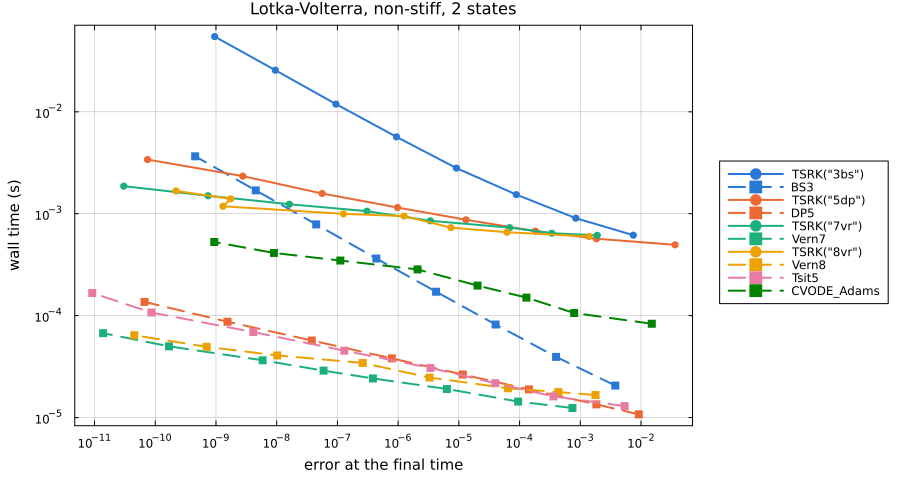
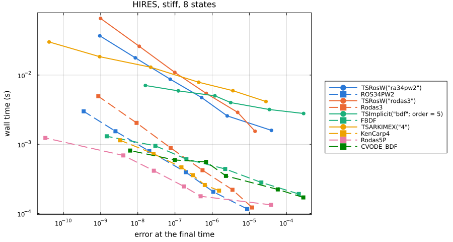
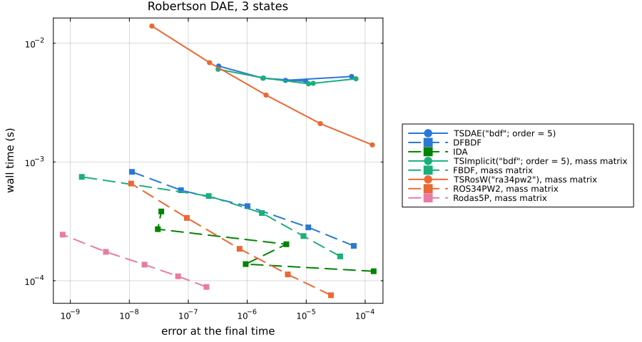
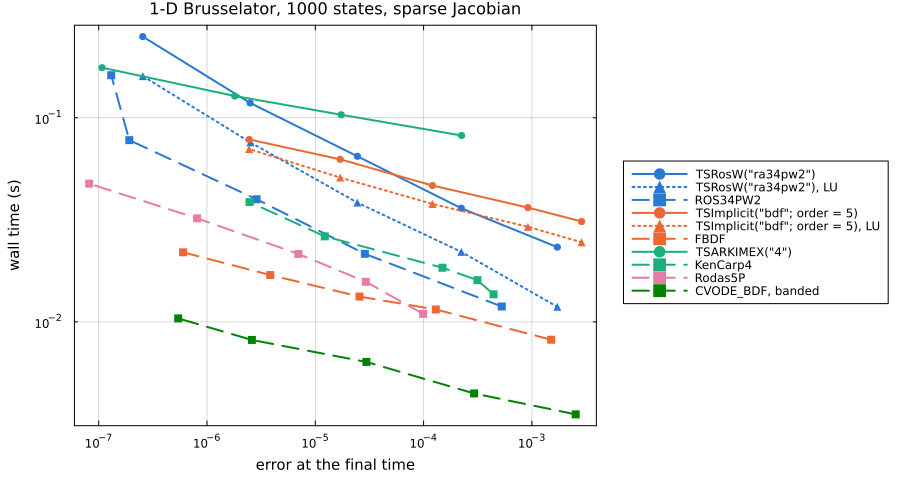

# Work-precision benchmarks

These benchmarks put PETScDiffEq's TS families next to OrdinaryDiffEq and Sundials on four
standard problems: a non-stiff ODE, a stiff ODE, a DAE, and a 1-D PDE with a sparse
Jacobian. Each point is one pair of tolerances: the error against a reference solution,
and the wall time of the fastest of up to 20 solves, as DiffEqDevTools' `WorkPrecisionSet`
measures them. Lower and further left is better.

The error is the mean absolute error at the final time. Each reference was checked against a
second solver, and the two agree at the final time to within 5e-10 on every
problem ([`reference.csv`](assets/workprecision/reference.csv)), far below the errors
plotted.

Solid lines with circles are PETScDiffEq with PETSc's default linear solver, GMRES
preconditioned with ILU(0). Dotted lines with triangles are PETScDiffEq with a direct LU
solve, `petsc_options = ["-ksp_type", "preonly", "-pc_type", "lu"]`. Dashed lines with
squares are OrdinaryDiffEq or Sundials. Lines of one color are the same method or its
nearest counterpart. Five pairs share their coefficients, which fixed-step solves confirm by
agreeing to rounding: `TSRK("3bs")` and `BS3`, `TSRK("5dp")` and `DP5`,
`TSRosW("ra34pw2")` and `ROS34PW2`, `TSRosW("rodas3")` and `Rodas3`, and
`TSARKIMEX("4")` and `KenCarp4`. `TSRK("7vr")` and `TSRK("8vr")` use different Verner pairs
from `Vern7` and `Vern8`.

The numbers were measured with Julia 1.10.12, one thread, on a 16-CPU Modal container,
with PETSc_jll 3.22.2 and the package versions in
[`environment.csv`](assets/workprecision/environment.csv). Every point is in the CSV file
next to its plot, with its step, rejection, function, Jacobian and Newton iteration counts.

## Summary

PETScDiffEq is slower than the fastest OrdinaryDiffEq or Sundials method on all four
problems, and slower than the same method in OrdinaryDiffEq wherever the coefficients match:

| Problem | Fastest PETScDiffEq method, relative to the fastest overall | Same method, PETScDiffEq relative to OrdinaryDiffEq |
|:--- | ---:| ---:|
| Lotka-Volterra, 2 states | 35 | 29 (`TSRK("5dp")`, `DP5`) |
| HIRES, 8 states | 21 | 16 (`TSRosW("ra34pw2")`, `ROS34PW2`) |
| Robertson DAE, 3 states | at least 51 | 26 (`TSRosW("ra34pw2")`, `ROS34PW2`) |
| Brusselator, 1000 states | 7.1 | 1.8 (`TSRosW("ra34pw2")` with LU, `ROS34PW2`) |

The gap narrows as the problem grows because much of PETScDiffEq's cost does not grow with
it: a fixed cost for each solve, and a cost for each step and each call back into Julia.
With BDF and ARKIMEX, PETSc also rebuilds and refactors the Jacobian at every Newton
iteration, where OrdinaryDiffEq and Sundials reuse one over many steps. Both are measured
under [Where the time goes](@ref).

## Non-stiff: Lotka-Volterra

``u_1' = 1.5 u_1 - u_1 u_2``, ``u_2' = -3 u_2 + u_1 u_2``, ``u(0) = (1, 1)``, ``t \in [0, 10]``,
with `abstol` from 1e-6 to 1e-13 and `reltol` from 1e-3 to 1e-10. The reference is `Vern9` at
1e-14.



Time to an error of 1e-8, interpolated between the measured points
([data](assets/workprecision/lotka_volterra.csv)):

| Solver | Time (ms) | Relative to the fastest |
|:--- | ---:| ---:|
| `TSRK("3bs")` | 25.1 | 727.6 |
| `BS3` | 1.3 | 37.6 |
| `TSRK("5dp")` | 1.98 | 57.2 |
| `DP5` | 0.0681 | 2.0 |
| `TSRK("7vr")` | 1.28 | 36.9 |
| `Vern7` | 0.0346 | 1.0 |
| `TSRK("8vr")` | 1.22 | 35.3 |
| `Vern8` | 0.0408 | 1.2 |
| `Tsit5` | 0.062 | 1.8 |
| `CVODE_Adams` | 0.409 | 11.8 |

`TSRK("5dp")` and `DP5` take nearly the same steps: 549 and 579 at the tightest tolerance,
ending 7.5e-11 and 6.7e-11 from the reference, in 3.4 ms and 0.14 ms. The whole gap is the
cost of a step, 6.1 µs against 0.24 µs. At loose tolerances the PETScDiffEq lines flatten
near 0.5 ms, about twice the fixed cost of a solve measured below.

## Stiff: HIRES

The eight-state HIRES problem on ``[0, 321.8122]``, with `abstol` from 1e-5 to 1e-10 and
`reltol` from 1e-2 to 1e-7. The reference is `Rodas5P` at 1e-14.



Time to an error of 1e-7 ([data](assets/workprecision/hires.csv)):

| Solver | Time (ms) | Relative to the fastest |
|:--- | ---:| ---:|
| `TSRosW("ra34pw2")` | 7.94 | 27.6 |
| `ROS34PW2` | 0.486 | 1.7 |
| `TSRosW("rodas3")` | 10.9 | 37.9 |
| `Rodas3` | 0.801 | 2.8 |
| `TSImplicit("bdf"; order = 5)` | 6.02 | 20.9 |
| `FBDF` | 0.718 | 2.5 |
| `TSARKIMEX("4")` | 10.1 | 35.1 |
| `KenCarp4` | 0.516 | 1.8 |
| `Rodas5P` | 0.288 | 1.0 |
| `CVODE_BDF` | 0.593 | 2.1 |

At `abstol = 1e-7`, `TSRosW("ra34pw2")` makes 144 step attempts in 4.7 ms, about 33 µs
each, and `ROS34PW2` makes 211 in 0.40 ms, about 1.9 µs each. The implicit families pay for
their Jacobians as well; see [Where the time goes](@ref).

## DAE: Robertson

Robertson's reaction on ``[0, 10^5]``, both as a `DAEProblem` whose third equation is
``u_1 + u_2 + u_3 = 1`` and as an `ODEProblem` with the mass matrix
``\mathrm{diag}(1, 1, 0)``, with `abstol` from 1e-6 to 1e-10 and `reltol` from 1e-2 to 1e-6.
The reference is `Rodas5P` on the mass-matrix form at 1e-14, checked against `IDA` at 1e-12.



Time to an error of 1e-6 ([data](assets/workprecision/robertson_dae.csv)):

| Solver | Time (ms) | Relative to the fastest |
|:--- | ---:| ---:|
| `TSDAE("bdf"; order = 5)` | 5.51 | 62.2 |
| `DFBDF` | 0.425 | 4.8 |
| `IDA` | 0.14 | 1.6 |
| `TSImplicit("bdf"; order = 5)`, mass matrix | 5.41 | 61.1 |
| `FBDF`, mass matrix | 0.407 | 4.6 |
| `TSRosW("ra34pw2")`, mass matrix | 4.51 | 50.9 |
| `ROS34PW2`, mass matrix | 0.171 | 1.9 |
| `Rodas5P`, mass matrix | at most 0.0886 | 1.0 |

`Rodas5P` was already below 1e-6 at the loosest tolerances, so its entry is its cheapest
run and the other ratios are lower bounds. PETSc's BDF gives similar errors and times
through `TSDAE` and through the mass matrix. Its error follows the tolerance less closely
than `DFBDF`'s: from 5.9e-5 at the loosest tolerances to 3.3e-7 at the tightest, where
`DFBDF` goes from 6.4e-5 to 1.1e-8.

## PDE: 1-D Brusselator

The Brusselator of Hairer and Wanner,
``u_t = 1 + u^2 v - 4u + \alpha u_{xx}``, ``v_t = 3u - u^2 v + \alpha v_{xx}``,
``\alpha = 1/50``, on 500 interior points of ``[0, 1]`` with ``u = 1`` and ``v = 3`` at the
ends and ``u(x, 0) = 1 + \sin(2\pi x)``, ``v(x, 0) = 3``, over ``t \in [0, 10]``. That is
1000 states, with ``u`` and ``v`` interleaved so the Jacobian has bandwidth 2. Every method
but CVODE gets the sparsity as a `jac_prototype` and builds the Jacobian with ForwardDiff
and colouring; CVODE uses its banded difference quotients. `abstol` runs from 1e-5 to 1e-9
and `reltol` from 1e-3 to 1e-7. The reference is `Rodas5P` at 1e-12, checked against `CVODE_BDF`
at 1e-12.



Time to an error of 1e-5 ([data](assets/workprecision/brusselator.csv)):

| Solver | Time (ms) | Relative to the fastest |
|:--- | ---:| ---:|
| `TSRosW("ra34pw2")` | 82 | 11.5 |
| `TSRosW("ra34pw2")`, LU | 50.2 | 7.1 |
| `ROS34PW2` | 28.6 | 4.0 |
| `TSImplicit("bdf"; order = 5)` | 66.5 | 9.4 |
| `TSImplicit("bdf"; order = 5)`, LU | 55.6 | 7.8 |
| `FBDF` | 15 | 2.1 |
| `TSARKIMEX("4")` | 109 | 15.3 |
| `KenCarp4` | 27.6 | 3.9 |
| `Rodas5P` | 19.9 | 2.8 |
| `CVODE_BDF`, banded | 7.11 | 1.0 |

This is the closest of the four: `TSRosW("ra34pw2")` with LU is 1.8 times `ROS34PW2` at this
error. At its loosest tolerance `TSARKIMEX("4")` ends with `ConvergenceFailure` after a
failed Newton solve, so that point is missing.

## Where the time goes

### A fixed cost per solve and per step

A fixed-step `TSRK("4")` against `RK4()` on ``u' = -u`` with `dt = 1e-3`, timing one step
and 1000 steps ([data](assets/workprecision/overhead.csv)):

| States | PETScDiffEq per solve (µs) | PETScDiffEq per step (µs) | OrdinaryDiffEq per solve (µs) | OrdinaryDiffEq per step (µs) |
| ---:| ---:| ---:| ---:| ---:|
| 1 | 240 | 5.37 | 2.0 | 0.118 |
| 100 | 253 | 5.87 | 3.6 | 0.275 |
| 10000 | 434 | 71.7 | 124 | 28.4 |

A one-step solve takes about a quarter of a millisecond, most of it setting up PETSc's
solver and its options. Each step then runs through PETSc's own stepping code and calls
back into Julia for every right-hand side, copying the state out of PETSc's vector and the
derivative back in, and once more after the step to record it. At one state a step costs
45 times what OrdinaryDiffEq's does, and at 10000 states 2.5 times.

On the small stiff problems little of the time is in the user's functions. PETSc's log of
`TSRosW("ra34pw2")` on HIRES, at `abstol = 1e-8` and `reltol = 1e-5`, puts 12% of the run in
the Julia callbacks for ``f`` and the Jacobian, 0.9 µs a right-hand side call, and 38% in
the 5500 linear solves of an 8 by 8 system, 4.7 µs each. Most of the rest is PETSc's
stepping and nonlinear solver code around them.

### The Jacobian at every Newton iteration

PETSc's nonlinear solver rebuilds the Jacobian at every Newton iteration unless told to lag
it, and PETScDiffEq keeps that default. `TSImplicit` and `TSARKIMEX` therefore evaluate and
factor one Jacobian per iteration, where OrdinaryDiffEq and Sundials reuse one over many
steps. On HIRES at `abstol = 1e-7`:

| Solver | Steps | Newton iterations | Jacobians |
|:--- | ---:| ---:| ---:|
| `TSImplicit("bdf"; order = 5)` | 126 | 244 | 244 |
| `FBDF` | 166 | 554 | 8 |
| `CVODE_BDF` | 240 | 411 | 10 |
| `TSARKIMEX("4")` | 39 | 573 | 574 |
| `KenCarp4` | 42 | 932 | 21 |

On the Brusselator the Jacobian and its factorization are the largest costs: PETSc's log of
`TSImplicit("bdf"; order = 5)` with LU puts 38% of the run in evaluating the Jacobian and 29%
in factoring it. PETSc's `-snes_lag_jacobian` and `-snes_lag_jacobian_persists` options
reuse a Jacobian across iterations and steps. The Brusselator at `abstol = 1e-8` and
`reltol = 1e-5`, the fastest of five runs with PETSc's logging on, where `lagged` adds
`["-snes_lag_jacobian", "10", "-snes_lag_jacobian_persists", "true"]` to the LU options:

| Solver | Time (ms) | Error | Jacobians | Newton iterations |
|:--- | ---:| ---:| ---:| ---:|
| `TSRosW("ra34pw2")` | 71.7 | 2.43e-5 | 192 | 768 |
| `TSRosW("ra34pw2")`, LU | 39.2 | 2.42e-5 | 192 | 768 |
| `TSImplicit("bdf"; order = 5)` | 48.1 | 1.29e-4 | 275 | 275 |
| `TSImplicit("bdf"; order = 5)`, LU | 39.8 | 1.29e-4 | 258 | 258 |
| `TSImplicit("bdf"; order = 5)`, LU, lagged | 24.0 | 1.27e-4 | 56 | 552 |
| `TSARKIMEX("4")`, LU | 83.2 | 1.00e-5 | 575 | 574 |
| `TSARKIMEX("4")`, LU, lagged | 34.7 | 1.00e-5 | 91 | 907 |

`TSRosW` counts its one linear solve per stage as a Newton iteration, and forms one
Jacobian per step attempt.

### The linear solver

PETSc's default linear solver is GMRES with an ILU(0) preconditioner and a relative
tolerance of 1e-5. On the Brusselator it takes about four GMRES iterations per solve, and
a direct LU solve with the same Jacobians is faster at the same error, 39.2 ms against
71.7 ms for `TSRosW("ra34pw2")` in the table above. For a problem this size, pass
`["-ksp_type", "preonly", "-pc_type", "lu"]`.

## Rerunning

The scripts are in `benchmark/workprecision`. From the repository root:

```sh
julia --project=benchmark/workprecision -e 'using Pkg; Pkg.develop(path = "."); Pkg.instantiate()'
GKSwstype=100 julia --project=benchmark/workprecision benchmark/workprecision/workprecision.jl
julia --project=benchmark/workprecision benchmark/workprecision/profile.jl
```

The first run writes the CSV files and plots into `docs/src/assets/workprecision`.
Passing `report` instead redraws the plots from those CSV files and prints the tables on
this page. `profile.jl` prints PETSc's `-log_view` with one stage per solve, the source of
the PETSc log figures above.
